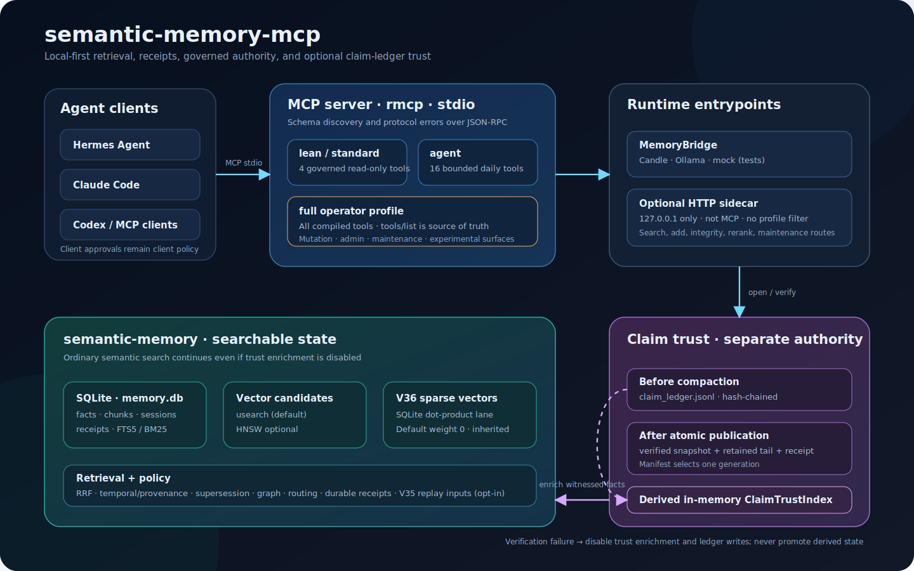
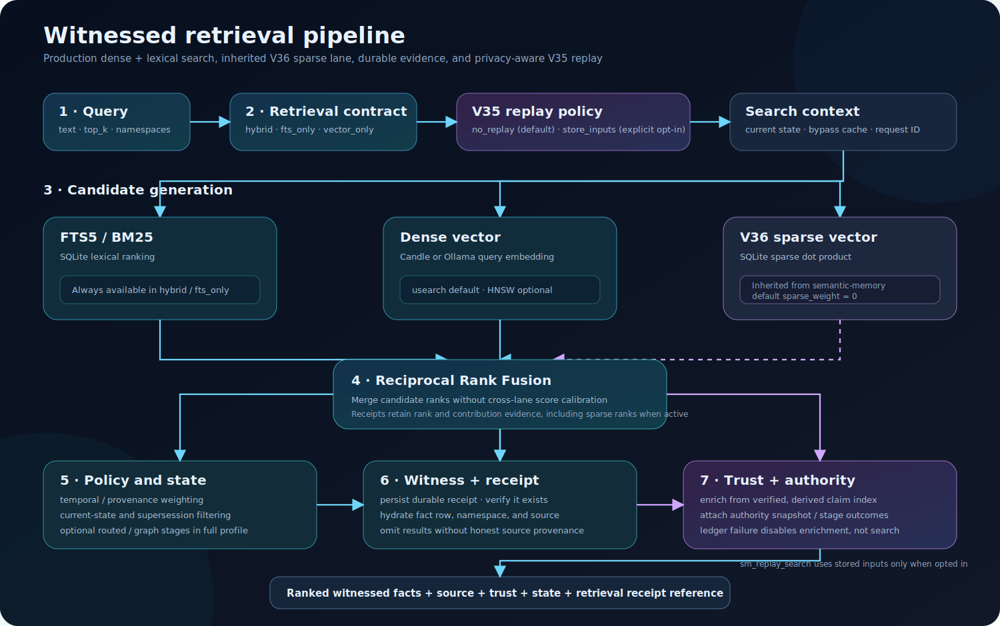

# semantic-memory-mcp

`semantic-memory-mcp` is a local-first Model Context Protocol server for the
[`semantic-memory`](../semantic-memory) Rust library. It gives MCP clients
persistent semantic search, witnessed retrieval, durable receipts, governed
authority decisions, graph and lifecycle tools, and optional claim-ledger trust
enrichment over a store that remains on the operator's machine.

The default build uses SQLite/FTS5, the usearch vector backend, and an
in-process Candle embedder. Ollama is an alternative embedder. The first Candle
run downloads the configured Hugging Face model; after that, normal search and
storage do not require a hosted database or API key.

[](docs/architecture.svg)

## Status at a glance

The current Rust source and `Cargo.toml` are authoritative. In particular:

- The binary serves MCP over stdio. `--http-port` can add a loopback-only warm
  HTTP surface; `--http-only` disables stdio.
- `lean` and `standard` are aliases in behavior and expose four governed,
  read-only tools.
- `agent` exposes a bounded 11-tool read-only surface.
- `full` exposes every tool compiled into that build. Its size can change with
  feature selection, so this README does not freeze a full-profile tool count.
- MCP `tools/list` is the source of truth for the tools available in a specific
  binary, profile, and build.
- The `full` Cargo feature is the default and is currently an alias for
  `search`; it is unrelated to the runtime `--tool-profile full` switch.

## Install

From a checkout with the sibling path dependencies present:

```bash
cargo build --release
./target/release/semantic-memory-mcp \
  --memory-dir "$HOME/.local/share/semantic-memory" \
  --tool-profile agent
```

Or install the published package when its registry dependencies match the
release you intend to run:

```bash
cargo install semantic-memory-mcp --locked --version '=0.5.5'
```

The Candle model defaults to `nomic-ai/nomic-embed-text-v1.5` through the
`nomic-embed-text` alias. To use Ollama instead:

```bash
ollama pull nomic-embed-text
semantic-memory-mcp \
  --memory-dir "$HOME/.local/share/semantic-memory" \
  --embedder ollama \
  --embedding-url http://localhost:11434 \
  --tool-profile agent
```

`--memory-dir` names a directory, not a database file. The store creates
`memory.db` and its index sidecars below that directory.

## CLI reference

The options below match `src/main.rs` and the generated `--help` surface.

| Option | Required/default | Meaning |
| --- | --- | --- |
| `--memory-dir <MEMORY_DIR>` | required | Store directory, created when absent. |
| `--embedder <EMBEDDER>` | `candle` | `candle`, `ollama`, or the test-only `mock` backend. |
| `--embedding-url <EMBEDDING_URL>` | Ollama default `http://localhost:11434` | Used only by the Ollama backend. |
| `--embedding-model <EMBEDDING_MODEL>` | `nomic-embed-text` | Candle Hugging Face model ID/alias or Ollama model name. |
| `--embedding-dims <EMBEDDING_DIMS>` | `768` | Embedding dimensions. Must match the chosen model/store. |
| `--http-port <HTTP_PORT>` | unset | Start the warm HTTP server on `127.0.0.1:<port>` alongside MCP. |
| `--http-only` | false | Skip stdio MCP and keep only HTTP running. Requires `--http-port` for a useful process. |
| `--turbo-quant` | false | Request TurboQuant candidate generation with exact `f32` reranking. The local `full` feature must be active for the bridge wiring to run. |
| `--turbo-quant-bits <TURBO_QUANT_BITS>` | codec default `8` | Polar angle bits, used only with `--turbo-quant`. |
| `--turbo-quant-projections <TURBO_QUANT_PROJECTIONS>` | codec default `16` | QJL projection count, used only with `--turbo-quant`. |
| `--tool-profile <TOOL_PROFILE>` | `lean` | `stable`, `lean`, `standard`, `agent`, or `full`. Unknown values are rejected by typed CLI parsing before the store is opened. |
| `-h`, `--help` | — | Print generated help. |

The typed profile manifest in `src/profile.rs` supplies profile names, bounded
allowlists, effect classes, and HTTP effect capabilities. Use `tools/list` when
automating against a deployed binary.

## Tool profiles

### `lean` and `standard`

These autonomous profiles expose exactly:

- `sm_search_witnessed`
- `sm_replay_search`
- `sm_decide_assertion_authority`
- `sm_decide_action_authority`

They do not expose raw search, mutation, maintenance, import, or administration.

### `agent`

The daily coding-agent profile exposes 11 read-only tools:

```text
sm_decide_action_authority     sm_decide_assertion_authority
sm_get_fact                    sm_get_fact_neighbors
sm_get_search_receipt          sm_graph_path
sm_list_namespaces             sm_replay_search
sm_search_conversations        sm_search_witnessed
sm_stats
```

It is read-only until a trusted authenticated authority issuer is injected. It
excludes mutation, deletion, raw/unwitnessed search, imports, lifecycle
administration, reconciliation, vacuuming, and re-embedding. Use `lean` for
autonomous recall and authority decisions; use `full` for operator mutation.

### `full`

This is the operator profile. It exposes every tool registered by the compiled
router, including mutating, destructive, experimental, and maintenance tools.
Tool annotations describe read-only, idempotent, and destructive intent, but an
MCP client must still enforce its own approval policy. Inspect `tools/list`
before granting this profile to an autonomous process.

## Witnessed retrieval, replay, and authority

`sm_search_witnessed` is the safe autonomous retrieval surface. It bypasses the
cache, requires a durable receipt, defaults to current state, and only returns
persisted facts whose source provenance can be hydrated honestly. Its
`retrieval_mode` is `hybrid`, `fts_only`, or `vector_only`.

V35 complete replay is privacy-sensitive and opt-in. The default
`replay_mode: "no_replay"` stores receipt digests and result evidence without
retaining the query/filter inputs needed for complete replay. Set
`replay_mode: "store_inputs"` on witnessed search only when that retention is
acceptable, then call `sm_replay_search` with the original receipt ID.
`sm_replay_search_receipt` remains a full-profile alternative that requires the
caller to resupply the query and filters.

Recall authority never implies permission to assert a result as true or to act
on it. `sm_decide_assertion_authority` and `sm_decide_action_authority` make
separate, fixed-purpose decisions from caller, subject, audience, namespace
scope, and an optional delegation/elevation lease. They return a typed decision
receipt and intentionally omit memory content; neither tool performs the
assertion or action.

## Trust architecture

The semantic store and the trust ledger have different jobs:

1. `memory.db`, FTS5, and vector/sparse indexes hold searchable memory.
2. Before first compaction, `claim_ledger.jsonl` is the hash-chained trust
   authority.
3. After compaction, an atomically selected, digest-verified snapshot plus
   retained JSONL tail represents the same ledger history. The snapshot is a
   checkpoint, never an independent truth store.
4. A process-local `ClaimTrustIndex` is derived from the verified snapshot and
   tail (or the legacy JSONL) at startup. It is an acceleration structure and is
   never persisted as authority.

Search trust enrichment uses six quality states:

| State | Meaning | Default proof debt |
| --- | --- | --- |
| `supported` | Recorded evidence supports the linked claim. | none |
| `partially_supported` | Recorded evidence supports only part of it. | none in the current mapper |
| `unsupported` | The judgment rejects support. | missing source basis |
| `contradicted` | Contradictory evidence has been recorded. | missing source basis + missing reproduction |
| `heuristic_only` | The judgment is heuristic rather than evidentiary. | missing source basis |
| `persisted_unjudged` | The fact has no linked judgment, or claim integration is absent. | missing source basis only when a linked claim exists; no claim means no claim debt to score |

`sm_search_proof_debt` exposes debt-aware retrieval and a budget gate;
`sm_benchmark_trust` reports the distribution of the six states. Proof debt is
an obligation signal, not a replacement for source inspection.

If the legacy ledger, active manifest, snapshot, retained tail, or compaction
receipt fails verification, the server disables claim trust enrichment and
refuses ledger append/compaction. Ordinary semantic storage and search remain
available. Results report trust enrichment as disabled where that path can
surface it; corruption does not promote an unverified ledger or erase the
semantic database.

### Claim-ledger compaction

`sm_compact_claim_ledger` is a destructive-annotated, full-profile,
claim-integration tool. It defaults to a dry run:

```json
{
  "dry_run": true,
  "max_entries": 10000,
  "max_bytes": 16777216,
  "retain_tail_entries": 256,
  "max_backups": 3
}
```

No publication occurs unless a threshold is exceeded and `dry_run` is
explicitly false. A real compaction writes and fsyncs a temporary generation
containing `snapshot.json`, `tail.jsonl`, and `receipt.json`, renames that
generation into place, then atomically replaces
`claim_ledger.active_compaction.json`. That manifest rename is the publication
boundary: startup ignores incomplete temporary generations and accepts only the
manifest-selected generation after digest verification.

## Search pipeline

[](docs/search-pipeline.svg)

The production search path is implemented by `semantic-memory`:

1. Embed or tokenize the query.
2. Retrieve FTS5/BM25 and usearch vector candidates.
3. When configured and represented by the active embedder, retrieve V36 sparse
   dot-product candidates from SQLite.
4. Fuse ranks with RRF and apply temporal/provenance policy.
5. Filter superseded heads for the normal MCP search surfaces.
6. Persist receipts and, for witnessed search, hydrate source provenance,
   authority state, and optional claim-ledger trust.

V36 sparse storage and ranking are inherited from `semantic-memory`; this MCP
crate does not define a separate sparse feature or CLI switch. The default
`SearchConfig` has `sparse_weight = 0`, so sparse retrieval is dormant unless a
library-level configuration enables it. The active embedder must also provide a
sparse representation, or explicit dense-to-sparse derivation must be enabled.

Advanced full-profile tools can additionally route queries, explain ranking,
traverse stored graph edges, detect contradictions, run factor-graph analysis,
inspect topology/communities, and perform lifecycle or maintenance work. Those
surfaces are not implied by the four-tool autonomous profile.

## Cargo features

These are the exact local features declared in `Cargo.toml`:

| Feature | Default? | What it enables |
| --- | --- | --- |
| `default` | yes | `full` |
| `full` | via default | Alias for `search`; also activates local `cfg(feature = "full")` wiring such as TurboQuant candidate selection. |
| `search` | via `full` | The supported composed router build: usearch, Candle, provenance, temporal, multiscale, discord, decoder, subtraction, compression governor, routing, admin ops, late interaction, TurboQuant codec, RL routing, plus the local integration features below. |
| `integration` | via `search` | Forwards `semantic-memory/integration`. |
| `subgraph-pruning` | via `search` | Forwards `semantic-memory/subgraph-pruning` and enables `sm_subgraph_prune`. |
| `candle-embedder` | via `search` | Forwards the in-process Candle backend. |
| `claim-integration` | via `search` | Adds the optional `claim-ledger` dependency and claim/trust/compaction tools. |
| `llm-parser` | via `search` | Adds the optional `llm-output-parser` dependency and parser tools. |
| `orchestration` | via `search` | Adds `knowledge-runtime` and provenance/temporal orchestration tools. |
| `hnsw` | no | Forwards the alternative `semantic-memory/hnsw` backend and enables compact/rebuild HNSW endpoint code where gated. |

`cargo build --no-default-features --features search` compiles the composed
search feature without setting the local `full` cfg. It is not a minimal tool
surface. Builds assembled from narrower individual features are feature-gated
development configurations, not the documented production default.

## Production-wired and experimental surfaces

Production-wired in the default build:

- stdio MCP, runtime tool-profile filtering, SQLite/FTS5, usearch, Candle and
  Ollama embedders;
- witnessed retrieval, V35 opt-in replay, governed assertion/action decisions,
  receipts, graph storage/traversal, claim-ledger verification and compaction;
- the composed `semantic-memory` routing, provenance, temporal, decoder,
  lifecycle, orchestration, parser, and admin capabilities exposed by the full
  router.

Opt-in, feature-gated, or operationally experimental:

- the loopback HTTP server is an auxiliary API, not MCP and not authenticated;
- `mock` embeddings are for tests;
- `hnsw` is an optional alternative to the default usearch backend;
- TurboQuant requires `--turbo-quant` and the local `full` cfg wiring;
- LLM reranking, entity extraction, and community summaries call a local Ollama
  service and are opt-in per operation;
- V36 sparse retrieval is inherited and disabled by the default search weight;
- broad maintenance, deletion, import, training-feedback, and lifecycle tools
  are operator-only even when compiled.

## HTTP sidecar

With `--http-port`, the process binds only to `127.0.0.1`. Current routes are:

```text
GET  /health
GET  /verify-integrity
POST /search
POST /search-routed
POST /rerank
POST /stats
POST /add
POST /record-outcome
POST /discord
POST /maintenance/check
POST /maintenance/vacuum
POST /maintenance/reembed
POST /maintenance/reconcile
POST /maintenance/rebuild-hnsw
POST /maintenance/compact-hnsw
```

The HTTP sidecar applies the selected profile below transport. Lean, standard,
and agent expose only `/health`; the explicit full operator profile exposes the
authenticated non-health surface. All non-health requests require a valid bearer
token. Mutation handlers without a trusted authority issuer fail closed. All
requests still require loopback Host/Origin validation.

## Agent integrations

First-class packages live in [`integrations/`](integrations/):

- [Hermes plugin](integrations/hermes/) — validates inputs and invokes the
  current `hermes mcp add/list/test/configure` CLI workflow without reimplementing
  any semantic-memory tools.
- [Claude Code plugin](integrations/claude-plugin/) — manifest, plugin-scoped
  MCP launcher, semantic-memory skill, and useful commands.
- [Codex integration](integrations/codex/) — open Agent Skill layout plus stdio
  MCP installation/config examples.
- [Install/test matrix](integrations/README.md) — side-by-side setup and smoke
  checks.

## Security and privacy

- Memory contents, sources, conversation messages, replay inputs, and claim
  evidence may be sensitive. Protect the entire memory directory with OS-level
  permissions and backups appropriate to its data classification.
- Candle's model download contacts Hugging Face on first use. Ollama mode sends
  text to the configured Ollama URL; a remote URL moves content off-host.
- `store_inputs` retains query/filter material for complete replay. It is off by
  default for privacy.
- The claim ledger is tamper-evident, not encrypted. Verification detects
  corruption; it does not stop a party with filesystem access from reading it.
- The `full` profile and HTTP maintenance routes include mutation, permanent
  deletion, model-feedback, import, vacuum, and rebuild operations. Grant them
  only to an operator context with explicit approval controls.
- `agent` is the recommended profile for trusted coding agents. It is read-only
  until a trusted authority issuer is injected. Use `lean` for autonomous
  read-only recall and authority decisions.
- Do not place secrets in facts, sources, metadata, replay inputs, plugin config,
  or command-line arguments. Process lists and logs may expose arguments.

## Integration quick starts

### Hermes Agent

Use the current CLI rather than hand-editing legacy YAML as the primary path:

```bash
hermes mcp add semantic_memory \
  --command semantic-memory-mcp \
  --args --memory-dir "$HOME/.local/share/semantic-memory" --tool-profile agent
hermes mcp list
hermes mcp test semantic_memory
hermes mcp configure semantic_memory
```

`--args` consumes the remaining arguments, so it must come last. The configure
step is interactive and controls which server-native tools Hermes exposes. The
packaged Hermes plugin provides guarded wrappers for these commands; see its
README.

### Claude Code

Test the local plugin directly:

```bash
SEMANTIC_MEMORY_MCP_BIN="$(command -v semantic-memory-mcp)" \
SEMANTIC_MEMORY_DIR="$HOME/.local/share/semantic-memory" \
SEMANTIC_MEMORY_TOOL_PROFILE=agent \
claude --plugin-dir ./integrations/claude-plugin
```

Inside Claude Code, run `/mcp`, then
`/semantic-memory:semantic-memory-status`. Use `claude --debug --plugin-dir
./integrations/claude-plugin` for startup diagnostics and `claude plugin
validate ./integrations/claude-plugin` when supported by the installed Claude
Code version.

### Codex

Install the stdio server with the CLI:

```bash
codex mcp add semantic_memory -- \
  semantic-memory-mcp \
  --memory-dir "$HOME/.local/share/semantic-memory" \
  --tool-profile agent
codex mcp list
```

Copy or symlink `integrations/codex/.agents/skills/semantic-memory` into the
repository's `.agents/skills/`, or keep the supplied structure at the project
root. Codex discovers skills from `.agents/skills` between the working directory
and repository root. See the Codex integration README for a TOML alternative.

## Development and validation

```bash
cargo fmt --check
cargo check
cargo test
```

Integration asset validation is read-only:

```bash
python3 integrations/tests/validate_integrations.py
```

## License

Apache-2.0. See [LICENSE](LICENSE).

## Upstream documentation

- [Model Context Protocol](https://modelcontextprotocol.io/)
- [Hermes plugins](https://hermes-agent.nousresearch.com/docs/user-guide/features/plugins)
- [Hermes MCP CLI](https://hermes-agent.nousresearch.com/docs/reference/cli-commands#hermes-mcp)
- [Claude Code plugins](https://code.claude.com/docs/en/plugins)
- [Claude Code plugin reference](https://code.claude.com/docs/en/plugins-reference)
- [Codex MCP](https://developers.openai.com/codex/mcp)
- [Codex Agent Skills](https://developers.openai.com/codex/skills)
