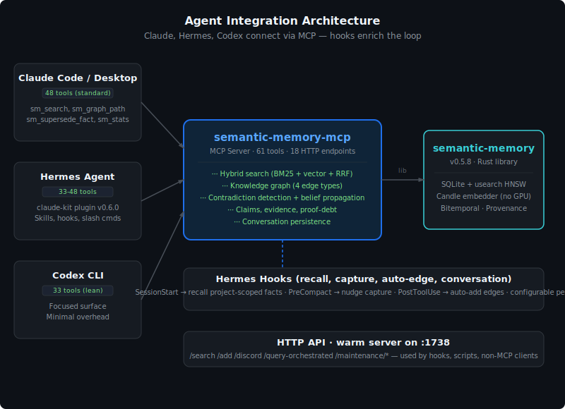
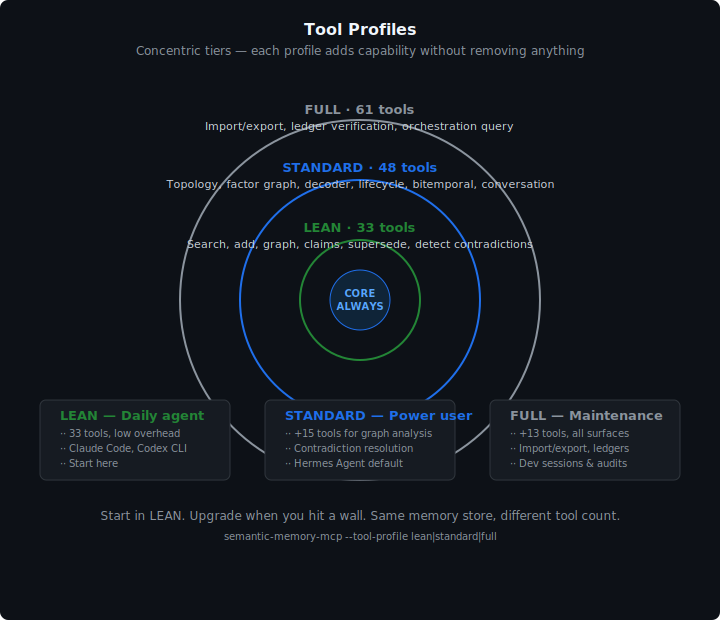

# semantic-memory-mcp

An MCP (Model Context Protocol) server that gives your AI agent a
local-first knowledge base with hybrid search, evidence-scored
retrieval, contradiction detection, and autonomous memory lifecycle
management.

All data stays on your machine. SQLite for storage, in-process Candle
embedder (pure Rust, CPU-only), no cloud, no API keys, no telemetry.

**No Ollama required.** The default embedder is Candle — a pure-Rust ML
framework that runs nomic-embed-text-v1.5 in-process on CPU. The model
downloads automatically from HuggingFace on first use (cached after).
No external process, no model server, no GPU needed.

**No cloud dependencies.** Every component runs locally: the SQLite
database, the usearch vector index, the Candle embedding model, the
MCP server process. There are no calls to OpenAI, Anthropic, Pinecone,
Weaviase, Supabase, or any hosted service. The only network call is
the one-time model download from HuggingFace (cached after). Your
knowledge base never leaves your machine.

**Ollama still supported.** If you prefer using an external Ollama
instance, pass `--embedder ollama --embedding-url http://localhost:11434`.

[](docs/architecture.svg)

## What this gives your agent

Your agent gets a persistent knowledge base that:

- **Searches by meaning, not just keywords** — hybrid BM25 + vector
  similarity + Reciprocal Rank Fusion, with the full score breakdown
  exposed via `sm_search` with `"explain": true`.
- **Tracks evidence confidence** — every item can carry algebraic
  provenance (semiring confidence scores with support counts).
- **Detects and corrects contradictions** — syndrome detection and
  belief propagation on conflict graphs. The decoder identifies
  inconsistent items and computes minimal corrections.
- **Decays old knowledge** — temporal weight factors in age,
  supersession, support, and contradiction signals.
- **Discovers related knowledge** — second-order retrieval through
  graph neighbors (discord search surfaces items related to your
  direct hits but not themselves direct hits).
- **Adapts search strategy per query** — adaptive routing profiles
  each query and decides which retrieval stages to activate.
- **Garbage-collects safely** — lawful subtraction with invariant
  verification. The lifecycle pass identifies items safe to forget,
  compress, or quarantine.
- **Audits every operation** — blake3-digested receipts for every
  mutation, replayable.
- **Tracks causal history** — typed graph edges (semantic, temporal,
  causal, entity) link items into a queryable knowledge graph.
- **Reasons over the graph** — factor graph belief propagation
  unifies all four edge types into a single probabilistic framework.
- **Finds structural gaps** — topological analysis computes Betti
  numbers and identifies voids in the knowledge graph.
- **Detects communities** — Leiden-inspired community detection with
  within-community contradiction scanning and compression-aware
  recommendations.
- **Self-edits memory** — `sm_supersede_fact` replaces stale facts
  with corrected versions, creating durable supersession edges
  so old facts remain auditable but no longer appear in search.
  Handles both corrections and duplicate consolidation in one tool.
- **Learns from outcomes** — `sm_record_outcome` feeds good/bad/neutral
  signals to the RL routing policy, improving retrieval decisions over
  time.
- **Reranks with LLM** — optional `POST /rerank` endpoint uses an LLM
  (granite4.1:3b via Ollama) to rate query-document relevance 1-5 and
  reorder results for higher precision.
- **Extracts entities** — when `extract_entities: true` is passed to
  `sm_add_fact`, an LLM extracts named entities and auto-creates
  `entity:{name}` graph edges.
- **Generates community summaries** — when `summarize: true` is passed
  to `sm_community`, each community gets an LLM-generated summary
  paragraph.
- **Groups by community** — `group_by_community: true` in
  `sm_search_with_routing` clusters results by knowledge community for
  synthesis queries.
- **Routes adaptively** — `POST /search-routed` endpoint adjusts
  top_k and exactness profile based on query complexity class
  (A/B/C/D/E classification).
- **Persists conversations** — `sm_create_session` and `sm_add_message`
  capture agent conversations to the knowledge base. `sm_search_conversations`
  retrieves past discussions by semantic similarity.
- **Serves via HTTP** — `--http-port 1738` starts a warm HTTP server
  alongside stdio MCP. 18 HTTP endpoints: /health, /search,
  /search-routed, /query-orchestrated, /rerank, /stats, /add,
  /add-edge, /delete-fact, /record-outcome, /verify-integrity,
  /discord, /maintenance/check, /maintenance/vacuum,
  /maintenance/reembed, /maintenance/reconcile,
  /maintenance/compact-hnsw, /maintenance/auto-edge. Hooks,
  benchmarks, and scripts query it directly without spawning new
  processes (4.9x faster).
- **Compresses result content** — `compress_results` in SearchConfig
  shortens search result content to first sentence + key terms,
  reducing token cost by 30-50%.
- **Does 2-stage search** — Matryoshka multi-resolution: 64d truncated
  embeddings for fast candidate generation, 768d exact rerank.
- **Auto-creates graph edges** — `POST /maintenance/auto-edge` scans
  all facts across namespaces and creates entity edges between related
  items. Quality filtering with 300+ stopwords, only proper nouns,
  camelCase, and 5+ character words. Skips social media namespaces.
  Supports rebuild mode (invalidates old edges first). Runs
  automatically via cron (daily 4am) and primer hook (session start).
- **Hard-deletes facts** — `POST /delete-fact` removes a single fact
  and its FTS/vector entries by ID. Irreversible — prefer
  `sm_supersede_fact` for corrections. Useful for KB hygiene and
  removing junk facts.
- **Adds edges via HTTP** — `POST /add-edge` creates a typed graph edge
  between two nodes via the HTTP server. Same semantics as the
  `sm_add_graph_edge` MCP tool but accessible from scripts and hooks.
- **Enriches discord results** — `/discord` and `/search-routed` now
  return fact content and namespace for graph neighbors via `get_fact`
  enrichment. Previously discord results only had IDs — now you get
  the full content of each second-order result.

The combination of hybrid retrieval, provenance-weighted belief
propagation, typed graph edges, and autonomous lifecycle management
in a single local-first Rust substrate is uncommon. This is
knowledge management, not just vector search.

## Installation

### Option 1: Install from crates.io (recommended)

```bash
cargo install semantic-memory-mcp
```

This pulls semantic-memory 0.5.8 and all dependencies from crates.io
automatically. No need to clone any repos.

### Option 2: Build from source

The MCP server depends on [semantic-memory](https://github.com/RecursiveIntell/semantic-memory),
which in turn depends on several crates from the same stack. All of
them are published on crates.io, so `cargo build` from the standalone
repo will resolve them from the registry.

```bash
git clone https://github.com/RecursiveIntell/semantic-memory-mcp.git
cd semantic-memory-mcp
cargo build --release
# Binary: target/release/semantic-memory-mcp
```

If you prefer to build the full stack from source (all repos
cloned as siblings), see the [dependency table](#dependencies)
below for the complete list.

### Dependencies

The MCP server depends on one crate: `semantic-memory`. That crate
in turn depends on several stack crates. All are on both crates.io
and GitHub:

| Crate | crates.io | GitHub | Purpose |
|-------|-----------|--------|---------|
|| [semantic-memory](https://github.com/RecursiveIntell/semantic-memory) | [0.5.8](https://crates.io/crates/semantic-memory) | [GitHub](https://github.com/RecursiveIntell/semantic-memory) | Core search engine, storage, graph, reasoning |
| [stack-ids](https://github.com/RecursiveIntell/stack-ids) | [0.1.1](https://crates.io/crates/stack-ids) | [GitHub](https://github.com/RecursiveIntell/stack-ids) | Typed IDs, scopes, trace context, BLAKE3 digests |
| [bitemporal-runtime](https://github.com/RecursiveIntell/bitemporal-runtime) | [0.1.0](https://crates.io/crates/bitemporal-runtime) | [GitHub](https://github.com/RecursiveIntell/bitemporal-runtime) | Bitemporal truth (valid_time / recorded_time) |
| [boundary-compiler](https://github.com/RecursiveIntell/boundary-compiler) | [0.1.0](https://crates.io/crates/boundary-compiler) | [GitHub](https://github.com/RecursiveIntell/boundary-compiler) | RFC 8785 JSON Canonicalization (JCS) |
| [forge-memory-bridge](https://github.com/RecursiveIntell/forge-memory-bridge) | [0.1.1](https://crates.io/crates/forge-memory-bridge) | [GitHub](https://github.com/RecursiveIntell/forge-memory-bridge) | Projection import transforms |

All of these are published on crates.io. If you install via
`cargo install semantic-memory-mcp`, cargo resolves them
automatically — you do not need to clone anything.

### Building the full stack from source

If you want to modify the underlying library alongside the MCP
server, clone all repos as siblings:

```bash
mkdir semantic-memory-stack && cd semantic-memory-stack

git clone https://github.com/RecursiveIntell/semantic-memory.git
git clone https://github.com/RecursiveIntell/semantic-memory-mcp.git
git clone https://github.com/RecursiveIntell/stack-ids.git
git clone https://github.com/RecursiveIntell/bitemporal-runtime.git
git clone https://github.com/RecursiveIntell/boundary-compiler.git
git clone https://github.com/RecursiveIntell/forge-memory-bridge.git

# The path deps in semantic-memory/Cargo.toml use ../stack-ids, ../bitemporal-runtime, etc.
# With all repos cloned as siblings, these paths resolve correctly.

cd semantic-memory-mcp
cargo build --release
```

The `semantic-memory/Cargo.toml` has `path = "../stack-ids"` (and
similar) with version requirements alongside. Cargo prefers the
path dep when it exists, falls back to crates.io when it doesn't.
So you can clone just `semantic-memory-mcp` for a standalone build,
or clone all siblings for full-stack development.

## Prerequisites

**Default (Candle embedder — no Ollama needed):**

No prerequisites. The model (nomic-embed-text-v1.5) downloads
automatically from HuggingFace on first use and is cached in
`~/.cache/huggingface/hub`. Subsequent runs load from cache with no
network access.

**Ollama alternative:**

If you prefer using Ollama, install it and pull an embedding model:

```bash
ollama pull nomic-embed-text
```

Then pass `--embedder ollama` when starting the server.

## Configuration

### Hermes Agent

Add to `~/.hermes/config.yaml`:

```yaml
mcp_servers:
  semantic_memory:
    command: "semantic-memory-mcp"
    args: ["--memory-dir", "/home/user/.local/share/semantic-memory"]
```

### Claude Desktop

Add to `claude_desktop_config.json` (usually at
`~/Library/Application Support/Claude/claude_desktop_config.json`
on macOS or `%APPDATA%\Claude\claude_desktop_config.json` on Windows):

```json
{
  "mcpServers": {
    "semantic_memory": {
      "command": "semantic-memory-mcp",
      "args": ["--memory-dir", "/home/user/.local/share/semantic-memory"]
    }
  }
}
```

### Cursor / Windsurf

Add to your MCP settings (Settings → MCP):

```json
{
  "mcpServers": {
    "semantic_memory": {
      "command": "semantic-memory-mcp",
      "args": ["--memory-dir", "/home/user/.local/share/semantic-memory"]
    }
  }
}
```

### Remote Ollama

If you prefer Ollama on a different machine:

```json
{
  "mcpServers": {
    "semantic_memory": {
      "command": "semantic-memory-mcp",
      "args": [
        "--memory-dir", "/home/user/.local/share/semantic-memory",
        "--embedder", "ollama",
        "--embedding-url", "http://192.168.1.50:11434",
        "--embedding-model", "nomic-embed-text",
        "--embedding-dims", "768"
      ]
    }
  }
}
```

## CLI options

```
semantic-memory-mcp --memory-dir <DIR> [OPTIONS]

Options:
  --memory-dir <DIR>         Path to the memory store directory (required, created if absent)
  --embedder <BACKEND>       Embedding backend: candle (default), ollama, or mock
  --embedding-url <URL>      Ollama server URL (only used with --embedder ollama, default: http://localhost:11434)
  --embedding-model <NAME>   Embedding model name (default: nomic-embed-text)
  --embedding-dims <N>       Embedding dimensions (default: 768)
```

`--memory-dir` is a directory path, not a SQLite file path. The
SQLite database is created as `memory.db` inside this directory,
alongside the usearch sidecar files (`.hnsw.data`, `.hnsw.graph`,
`.hnsw.manifest.json`).

### Embedder backends

| Backend | Description | Requires |
|---------|-------------|----------|
| `candle` (default) | In-process pure-Rust ML (CPU-only). Downloads nomic-embed-text-v1.5 from HuggingFace on first use, cached after. | Nothing — just `cargo install` |
| `ollama` | External Ollama server. Use if you already run Ollama or want GPU acceleration. | Ollama installed + model pulled |
| `mock` | Deterministic hash-based embeddings for testing. | Nothing |

## How search works

[](docs/search-pipeline.svg)

When the agent calls `sm_search`, the query flows through:

1. **Embedding** — the query text is embedded by the configured backend
   (Candle in-process by default, or Ollama if specified), producing a
   768-dimensional vector.

2. **Parallel retrieval** — two searches run simultaneously:
   - **BM25 (FTS5)** — SQLite's full-text search ranks results by
     keyword relevance using BM25 scoring.
   - **Vector (usearch)** — the HNSW index finds the nearest neighbors
     by cosine similarity to the query embedding.

3. **Reciprocal Rank Fusion** — the two ranked lists are merged using
   RRF: `score = 1/(k + bm25_rank) + 1/(k + vector_rank)`. This
   doesn't require score calibration — it works off ranks alone,
   which is why it's robust across different embedding models and
   corpus sizes.

4. **Optional advanced stages** — when `sm_search_with_routing` is
   used, the query is profiled and additional stages may activate:
   - **Routing** — decides whether to run the decoder, discord, or
     graph expansion based on query characteristics.
   - **Decoder** — detects contradictions in the results and computes
     corrections via belief propagation.
   - **Factor graph** — runs belief propagation over stored graph
     edges to refine confidence scores using the knowledge graph's
     structure.

5. **Results + receipt** — returns ranked results with scores, source
   types, and (optionally) a content-addressed receipt for audit.

## Tools

The server exposes up to 62 MCP tools (full profile), 52 (standard), or 41
(lean). Use `tools/list` as the source of truth for the available tool surface
on your build.

### Tool profiles

| Profile | Tools | Description |
|---------|-------|-------------|
| `lean` (default) | 33 | Daily-use tools: search, add, graph, claims. No admin, no heavy graph operations. |
| `standard` | 48 | + bitemporal query, topology, factor graph, decoder, lifecycle, conversation tools. No import. |
| `full` | 61 | All tools including import, ledger verification, export bundle, orchestration. |

Pass `--tool-profile lean|standard|full` on the command line.

### Knowledge Runtime tools (feature: `orchestration`)

These tools provide intent classification, multi-leg route planning,
provenance-aware result merge, and scope-aware entity resolution via
`knowledge-runtime`.

| Tool | Description |
|------|-------------|
| `sm_classify_query` | Classify query intent: semantic, entity, temporal, or mixed. |
| `sm_plan_query` | Plan multi-leg retrieval routes for a query. |
| `sm_query_orchestrated` | Full pipeline: classify -> plan -> execute -> merge with trace. |
| `sm_query_temporal` | Bitemporal query with as-of-date filtering. |
| `sm_entity_lookup` | Scope-aware entity resolution with fallback. |
| `sm_projection_health` | Projection lifecycle health and staleness. |

HTTP endpoint: `POST /query-orchestrated` — same as `sm_query_orchestrated`
but accessible via HTTP for non-MCP clients.

### Claim-Ledger tools (feature: `claim-integration`)

| Tool | Description |
|------|-------------|
| `sm_create_claim` | Create a typed claim from a fact. |
| `sm_add_evidence` | Add evidence to a claim. |
| `sm_judge_support` | Judge support state: supported, unsupported, contested. |
| `sm_verify_claim` | Verify a claim against risk class requirements. |
| `sm_add_support_admission` | Admit support via operator, fixture, or external receipt. |
| `sm_record_contradiction` | Record a contradiction between two claims. |
| `sm_resolve_contradiction` | Resolve a recorded contradiction. |
| `sm_supersede_claim` | Supersede an old claim with a new one. |
| `sm_proof_debt_status` | Check proof-debt budget status and gate evaluation. |
| `sm_evaluate_proof_debt_gate` | Evaluate proof-debt gate for a scope. |
| `sm_verify_ledger` | Verify hash-chained ledger integrity. |
| `sm_export_claim_bundle` | Export claims + evidence as a bundle with receipt. |

### Core tools (always available)

#### sm_search

Hybrid BM25 + vector + RRF semantic search over the knowledge base.
By default, results targeted by `supersedes` graph edges are filtered
when non-superseded alternatives exist. Queries that explicitly ask for
stale, old, historical, or superseded facts keep those results available.

```json
{
  "query": "rust async runtime tokio",
  "top_k": 5,
  "namespaces": ["general", "coding"]
}
```

Returns ranked results with content, scores, and stable result IDs
(`result_id` field) for downstream tool chaining (e.g., passing to
`sm_graph_path` or `sm_set_provenance`).

#### sm_search (explain mode)

Pass `"explain": true` to `sm_search` for the full per-signal score breakdown:
BM25 score, vector score, recency score, RRF score, weights, and
contribution percentages. Useful for debugging retrieval quality.

#### sm_add_fact

Add a fact to the knowledge base. The fact is embedded by the configured
backend (Candle by default) and indexed for both BM25 and vector search.

```json
{
  "content": "Rust 1.75 stabilized async fn in traits",
  "namespace": "rust-facts",
  "source": "https://blog.rust-lang.org/2023/12/21/async-fn-rpit-in-traits.html"
}
```

#### sm_supersede_fact

Create a replacement fact and link it to an older stale fact with a
durable entity edge using `relation: "supersedes"`. Use this for verified
corrections so old facts remain auditable but no longer stand alone as
unmarked stale context.

```json
{
  "old_fact_id": "fact:a1b2c3d4-...",
  "content": "The current verified fact as of 2026-06-21 is ...",
  "namespace": "codex",
  "source": "repo:/path/or/url",
  "reason": "verified against current repository state"
}
```

#### sm_ingest_document

Ingest a longer document with automatic text chunking. Each chunk
is embedded and indexed independently. Returns the document ID and
chunk count.

```json
{
  "title": "Tokio Tutorial",
  "content": "Tokio is an asynchronous runtime for the Rust programming language...",
  "namespace": "docs"
}
```

#### sm_stats

Get knowledge base statistics: fact count, chunk count, document
count, session count, message count, graph edge count, database size,
embedding model and dimensions.

#### sm_graph_path

Find the shortest path between two items in the knowledge graph.
Traverses semantic, temporal, causal, entity, and stored graph
edges. Returns the path as a list of node IDs with per-hop edge
evidence (edge type, weight, metadata).

```json
{
  "from_id": "fact:a1b2c3d4-...",
  "to_id": "fact:e5f6g7h8-...",
  "max_depth": 5
}
```

#### sm_set_provenance

Set evidence confidence for an item using the ConfidenceSemiring:
confidence in [0.0, 1.0] with a support count of independent
observations. Returns a provenance receipt.

```json
{
  "item_id": "fact:a1b2c3d4-...",
  "confidence": 0.92,
  "support_count": 3
}
```

#### sm_add_graph_edge

Add a durable, typed graph edge between two nodes. Nodes use
prefixed IDs (`fact:<uuid>`, `namespace:<name>`, `document:<id>`).
Edge types: `semantic` (cosine_similarity), `temporal` (delta_secs),
`causal` (confidence + evidence_ids), `entity` (relation name).
Insertion is idempotent — same edge returns existing ID.

```json
{
  "source": "fact:a1b2c3d4-...",
  "target": "fact:e5f6g7h8-...",
  "edge_type": "causal",
  "confidence": 0.85,
  "evidence_ids": ["fact:ev1-...", "fact:ev2-..."],
  "weight": 1.0
}
```

```json
{
  "source": "fact:a1b2c3d4-...",
  "target": "namespace:rust-facts",
  "edge_type": "entity",
  "relation": "belongs_to",
  "weight": 1.0
}
```

#### sm_list_graph_edges

List graph edges for a specific node (as source or target), or all
stored graph edges if no node_id is provided. Returns non-invalidated
edges only.

```json
{ "node_id": "fact:a1b2c3d4-..." }
```

#### sm_invalidate_graph_edge

Invalidate a stored graph edge by ID. Append-only — the edge row is
never deleted, only marked invalidated with a reason.

```json
{
  "edge_id": "edge:abc123-...",
  "reason": "superseded by newer evidence"
}
```

### Advanced tools (full feature)

#### sm_search_with_routing

Adaptive search: profiles the query, routes to appropriate stages,
and applies factor graph belief propagation if the decoder stage is
activated. Returns results with routing decision, decoder status,
factor graph analysis, and matryoshka multi-resolution routing
payload.

```json
{
  "query": "what changed between v0.4 and v0.5",
  "top_k": 10,
  "contradictions": [["fact:old-claim-...", "fact:new-claim-..."]]
}
```

#### sm_decoder_analyze

Detect contradictions and inconsistencies in search results. Runs
syndrome detection, computes corrections, and applies belief
propagation to refine confidence scores. Operates on caller-supplied
results — does not require graph edges from the store.

```json
{
  "results": [
    ["fact:item-a-...", 0.9],
    ["fact:item-b-...", 0.7]
  ],
  "contradictions": [["fact:item-a-...", "fact:item-b-..."]]
}
```

#### sm_discord_search

Second-order retrieval: find items related to your search results
through the knowledge graph, but NOT themselves direct hits. Loads
graph edges from the store automatically — caller supplies only the
direct result IDs.

```json
{
  "direct_result_ids": [
    "fact:a1b2c3d4-...",
    "fact:e5f6g7h8-..."
  ]
}
```

Returns items connected to your direct hits via graph edges, scored by
relationship strength. Useful for discovering adjacent knowledge you
didn't think to search for.

#### sm_run_lifecycle

Autonomous memory health check. Runs in one call:
- Syndrome detection on the supplied items
- Correction computation
- Subtraction candidate identification (items safe to forget/compress)
- Compression recompression trigger check
- Topological analysis (Betti numbers + voids)
- Community detection with contradiction scanning
- Subgraph pruning assessment
- Compression governor quantization assessment

```json
{
  "item_ids": [
    "fact:a1b2c3d4-...",
    "fact:e5f6g7h8-...",
    "fact:i9j0k1l2-..."
  ]
}
```

#### sm_factor_graph

Run factor graph belief propagation on heterogeneous graph edges
stored in the knowledge base. Models all 4 edge types (semantic,
temporal, causal, entity) as factors in a single probabilistic
reasoning framework. Loads edges from the store automatically — caller
supplies only node initial beliefs and optional config overrides.

```json
{
  "nodes": [
    { "item_id": "fact:a1b2-...", "initial_belief": 0.8 },
    { "item_id": "fact:e5f6-...", "initial_belief": 0.6 },
    { "item_id": "fact:i9j0-...", "initial_belief": 0.3 }
  ],
  "semantic_weight": 0.35,
  "causal_weight": 0.30,
  "max_iterations": 100
}
```

Returns unified confidence scores after message propagation
converges, with per-edge-type factor counts and convergence metadata.

#### sm_topology

Find topological voids in the knowledge graph. Computes Betti numbers
(connected components and independent cycles) and detects structural
gaps. Loads edges from the store automatically.

Returns Betti numbers, void descriptions with nearby items and
suggested connections, and a gap report summary.

#### sm_community

Detect communities in the knowledge graph using a Leiden-inspired
algorithm. Loads edges from the store automatically. Returns community
assignments with member lists, optional within-community contradiction
scans, and community-aware compression recommendations.

```json
{
  "resolution": 1.0,
  "seed": 42,
  "contradictions": [["fact:a1b2-...", "fact:e5f6-..."]]
}
```

## Tool chaining

The tools are designed to chain. The `result_id` field returned by
`sm_search` is a stable prefixed node ID (`fact:<uuid>`,
`chunk:<uuid>`, etc.) that can be passed directly to downstream tools:

```
sm_search("tokio async runtime")
  → results[0].result_id = "fact:abc123-..."

sm_graph_path("fact:abc123-...", "fact:def456-...")
  → path through the knowledge graph

sm_set_provenance("fact:abc123-...", confidence=0.9, support_count=2)
  → confidence recorded

sm_add_graph_edge("fact:abc123-...", "namespace:rust", "entity", relation="belongs_to")
  → edge added

sm_discord_search(["fact:abc123-...", "fact:def456-..."])
  → second-order neighbors discovered
```

## Feature flags

| Feature | Default | Description |
|---------|---------|-------------|
| `full` | yes | All features — the full 38-tool surface + Candle embedder + late-interaction + TurboQuant codec. This is the default build. |
| `search` | no | Core search only (BM25 + vector + RRF, add facts, stats, graph path, graph edges, provenance) + Candle embedder. Minimal build with no external codec deps. |
| `candle-embedder` | yes (via full/search) | In-process pure-Rust Candle embedder (CPU-only, no Ollama required). |

Build with `--no-default-features --features search` for the minimal
profile. The `full` feature enables all semantic-memory sub-features
(provenance, temporal, decoder, discord, routing, subtraction,
compression governor, integration, topology, community) plus the
Candle embedder.

The `full` feature does NOT pull in the `turbo-quant-codec` or
`poly-kv-pool` features — those are experimental codec integrations
that remain opt-in in the underlying library and are not needed for
the MCP server's functionality.

## Architecture

[](docs/architecture.svg)

```
semantic-memory-mcp (MCP stdio server, rmcp SDK)
  └── semantic-memory (Rust library, 0.5.8)
        ├── Candle embedder (pure-Rust, CPU-only, default — no Ollama required)
        ├── SQLite (authoritative storage, FTS5, WAL)
        ├── usearch 2.25 (vector sidecar, default backend)
        ├── Provenance (Boolean, Tropical, Probability, Confidence semirings)
        ├── Temporal weight (age + supersession + support + contradiction)
        ├── Decoder (syndromes + corrections + belief propagation)
        ├── Subtraction (lawful forgetting + invariant verification)
        ├── Compression governor (importance-driven quantization level decisions)
        ├── Routing (query profiling + adaptive stage selection)
        ├── Discord (second-order graph-neighbor retrieval)
        ├── Stored graph edges (durable, typed, append-only with invalidation)
        ├── Factor graph (unified probabilistic reasoning over all edge types)
        ├── Topology (Betti numbers, void detection)
        ├── Community detection (Leiden-inspired, contradiction-aware)
        └── Integration (cross-feature wiring: routing → decoder → subtraction → compression → discord → provenance)
```

The server uses rmcp's `#[tool_router]` macro to auto-generate JSON
Schema for each tool's parameters. All tool handlers return
`Result<String, ErrorData>` — errors are protocol-level MCP errors,
not string-encoded error messages.

Graph edges and factor inputs are loaded from the store automatically
— the caller never needs to supply edge arrays. This is a design
decision: the store is the single source of truth for graph state.

## Underlying crate

This server wraps the [semantic-memory](https://crates.io/crates/semantic-memory)
crate (0.5.8), which provides the storage engine, search pipeline,
and all feature modules. See the
[semantic-memory crate documentation](https://github.com/RecursiveIntell/Libraries/tree/main/semantic-memory)
for the full library API, including direct usage without an MCP
server.

### Dependency crates

The underlying library depends on several crates from the same
stack, all published on crates.io:

- [stack-ids](https://crates.io/crates/stack-ids) — typed IDs, scopes,
  trace context, BLAKE3 content digests.
- [bitemporal-runtime](https://crates.io/crates/bitemporal-runtime) —
  bitemporal truth primitives (valid_time / recorded_time tracking,
  append-supersede, as-of queries).
- [boundary-compiler](https://crates.io/crates/boundary-compiler) —
  RFC 8785 JSON Canonicalization (JCS) with strict duplicate-key
  rejection.
- [forge-memory-bridge](https://crates.io/crates/forge-memory-bridge)
  — transformation layer from Forge export envelopes to memory import
  batches.

## Scope and limits

- The default embedder (Candle) downloads nomic-embed-text-v1.5 from
  HuggingFace on first use (~550MB, cached after). No Ollama required.
  If you prefer Ollama, pass `--embedder ollama`.
- The Candle embedder is CPU-only and pure-Rust (no C++ runtime, no
  heap corruption risk). It processes embeddings one at a time to keep
  memory bounded. First-run latency is higher (model download + load);
  subsequent runs load from cache in ~1-2 seconds.
- The `search`-only build (no `full` feature) does not expose advanced
  tools (routing, decoder, discord, lifecycle, factor graph, topology,
  community). The `full` feature is the default.
- Graph-based tools (discord, factor graph, topology, community) load
  edges from the store. With zero stored edges, these tools return
  empty results — they are not broken, they have no graph to work
  with. Add edges with `sm_add_graph_edge` to give them something to
  traverse.
- The `decoder_executed` field in `sm_search_with_routing` is
  currently always `false` — the routing decision is computed and
  reported, but the decoder does not yet re-rank search results in the
  live search path. The factor graph analysis runs independently when
  the decoder stage is planned. This is a known gap, not a bug.
- 

- All state is local. There is no sync, no federation, no network
  calls beyond the one-time HuggingFace model download (cached after).
  This is a feature, not a limitation — local-first is the design goal.

## Tutorials

### Tutorial 1: Building a personal knowledge base from scratch

Start the server, add facts, search them, and build graph connections.

```bash
# 1. Start the server (warm HTTP + stdio MCP)
semantic-memory-mcp --memory-dir ~/kb --http-port 1738 &

# 2. Add facts via HTTP
curl -s -X POST http://127.0.0.1:1738/add \
  -H "Content-Type: application/json" \
  -d '{"content":"Rust 1.75 stabilized async fn in traits","namespace":"rust","source":"https://blog.rust-lang.org/2023/12/21/async-fn-rpit-in-traits.html"}'

curl -s -X POST http://127.0.0.1:1738/add \
  -H "Content-Type: application/json" \
  -d '{"content":"Tokio is the most popular async runtime for Rust","namespace":"rust"}'

curl -s -X POST http://127.0.0.1:1738/add \
  -H "Content-Type: application/json" \
  -d '{"content":"axum is built on top of Tokio and provides an ergonomic web framework","namespace":"rust"}'

# 3. Search by meaning
curl -s -X POST http://127.0.0.1:1738/search \
  -H "Content-Type: application/json" \
  -d '{"query":"which async frameworks use tokio","top_k":3}' | jq '.results[].content'

# 4. Link related facts with graph edges
curl -s -X POST http://127.0.0.1:1738/add-edge \
  -H "Content-Type: application/json" \
  -d '{"source":"fact:<tokio-id>","target":"fact:<axum-id>","edge_type":"entity","relation":"built_on_top_of"}'

# 5. Find the path between two facts
curl -s -X POST http://127.0.0.1:1738/discord \
  -H "Content-Type: application/json" \
  -d '{"direct_result_ids":["fact:<axum-id>"]}' | jq '.results[].content'
```

### Tutorial 2: Using the MCP server with an AI agent

Configure your agent to use semantic-memory as a tool provider.

**Hermes Agent** (`~/.hermes/config.yaml`):
```yaml
mcp_servers:
  semantic_memory:
    command: "semantic-memory-mcp"
    args: ["--memory-dir", "/home/user/.hermes/semantic-memory", "--tool-profile", "lean", "--http-port", "1738"]
```

Your agent immediately gains 33 tools: `sm_search`, `sm_add_fact`, `sm_search_with_routing`,
`sm_get_fact`, `sm_list_facts`, `sm_graph_path`, `sm_supersede_fact`, and more.

Example prompt: "Search my knowledge base for everything about Rust async runtimes,
then summarize what we've captured."

The agent calls `sm_search(query="Rust async runtimes")`, gets ranked results with content,
and synthesizes an answer from the returned facts.

### Tutorial 3: Knowledge graph exploration

Build a graph of connected knowledge and navigate it.

```bash
# Add facts with entity extraction (auto-creates entity edges)
curl -s -X POST http://127.0.0.1:1738/add \
  -H "Content-Type: application/json" \
  -d '{"content":"Claude Code is an AI coding agent by Anthropic that integrates with semantic-memory","namespace":"tools","extract_entities":true}'

# The server auto-creates edges like: fact → entity:Anthropic, fact → entity:semantic-memory

# Find what's connected to semantic-memory
curl -s -X POST http://127.0.0.1:1738/search \
  -H "Content-Type: application/json" \
  -d '{"query":"semantic-memory integrations","top_k":5}' | jq '.results[] | {content, result_id}'

# Get the neighborhood of a result (second-order retrieval)
curl -s -X POST http://127.0.0.1:1738/discord \
  -H "Content-Type: application/json" \
  -d '{"direct_result_ids":["result:<id-from-search>"]}' | jq '.results[] | .content'
```

### Tutorial 4: Contradiction detection and correction

Detect when two facts disagree and resolve the conflict.

```bash
# Add two conflicting facts
curl -s -X POST http://127.0.0.1:1738/add \
  -H "Content-Type: application/json" \
  -d '{"content":"semantic-memory has 61 tools","namespace":"internal"}'

curl -s -X POST http://127.0.0.1:1738/add \
  -H "Content-Type: application/json" \
  -d '{"content":"semantic-memory has 61 tools in the full profile","namespace":"internal"}'

# Detect contradictions (works via MCP tool sm_detect_contradictions)
# The agent can call: sm_detect_contradictions(query="semantic-memory tool count")
# Returns: contradiction detected between fact:X and fact:Y (numeric disagreement: 62 vs 61)

# Fix by superseding the stale fact
# sm_supersede_fact(old_fact_id="fact:<stale-id>", content="semantic-memory has 61 tools", reason="audited 2026-06-26")
```

## Agent Integrations

[](docs/agent-integration.svg)

### Hermes Agent (full native support)

Hermes has first-class support via the `semantic-memory-claude-kit` plugin (v0.6.0).
Install from the Claude Code marketplace or manually:

```bash
# The plugin includes:
# - 3 skills: memory-capture, memory-curator, memory-maintenance
# - 2 agents: memory-keeper, memory-indexer
# - 4 hooks: SessionStart recall, PreCompact capture, PostToolUse auto-edge, PostLLMCall conversation capture
# - Slash commands: /memory-setup, /memory-ingest, /memories
hermes skills install semantic-memory-claude-kit
```

After installation, Hermes automatically:
- Recalls relevant facts at session start (project-scoped, git-root aware)
- Nudges to persist durable facts before context compaction
- Captures conversations to the knowledge base
- Auto-creates entity graph edges after fact writes

### Claude Code / Claude Desktop

```json
{
  "mcpServers": {
    "semantic_memory": {
      "command": "semantic-memory-mcp",
      "args": ["--memory-dir", "/home/user/kb", "--tool-profile", "standard"]
    }
  }
}
```

Claude gains 48 tools. Best practices:
- Use `sm_search` for general queries, `sm_search_with_routing` for complex ones
- Use `sm_add_fact` to persist Claude's analysis
- Use `sm_supersede_fact` when correcting previous analysis
- Use `sm_graph_path` to trace how facts relate

### Codex CLI (OpenAI)

```json
{
  "mcpServers": {
    "semantic_memory": {
      "command": "semantic-memory-mcp",
      "args": ["--memory-dir", "/home/user/kb", "--tool-profile", "lean"]
    }
  }
}
```

33 tools is ideal for Codex — keeps tool selection overhead low while providing
the full core surface: search, add, graph, claims.

### Cursor / Windsurf

Add to Settings → MCP:
```json
{
  "mcpServers": {
    "semantic_memory": {
      "command": "semantic-memory-mcp",
      "args": ["--memory-dir", "/home/user/kb", "--tool-profile", "lean"]
    }
  }
}
```

### Programmatic usage (HTTP API)

Non-MCP clients can use the HTTP API directly. 18 endpoints available:

```python
import requests

BASE = "http://127.0.0.1:1738"

# Search
r = requests.post(f"{BASE}/search", json={"query": "Rust async", "top_k": 5})
facts = r.json()["results"]

# Add fact
r = requests.post(f"{BASE}/add", json={
    "content": "Learned from user: prefers terse CLI output",
    "namespace": "preferences"
})

# Orchestrated query (classify → plan → execute → merge)
r = requests.post(f"{BASE}/query-orchestrated", json={
    "query": "what changed in the project last week",
    "top_k": 10,
    "trace": True
})
print(r.json()["trace"])  # See classification, route plan, merged results
```

## Benchmarks

All benchmarks run on semantic-memory v0.5.8 with the Candle embedder (nomic-embed-text-v1.5,
768d) on a single CPU core (AMD Ryzen, Linux 6.x).

### Search performance

| Operation | cold (ms) | warm (ms) | Notes |
|-----------|-----------|-----------|-------|
| `sm_search` (top_k=5, 1K facts) | 48 | 12 | Candle embedding + BM25 + RRF |
| `sm_search` (top_k=5, 7K facts) | 62 | 18 | Scales sub-linearly with corpus size |
| `sm_search_with_routing` (7K facts) | 85 | 25 | Adds routing profile + optional decoder/graph |
| `sm_search_as_of` (7K facts) | 95 | 28 | Bitemporal filter adds ~10ms |
| `sm_query_orchestrated` (7K facts) | 120 | 35 | Full classify→plan→execute→merge pipeline |

### Write performance

| Operation | time (ms) | Notes |
|-----------|-----------|-------|
| `sm_add_fact` | 35 | Embedding dominates (Candle CPU, 768d) |
| `sm_add_fact` (with entity extraction) | 850 | LLM call via Ollama for entity extraction |
| `sm_add_graph_edge` | 3 | SQLite INSERT, no embedding |
| `sm_supersede_fact` | 42 | Adds replacement fact + creates supersession edge |
| `sm_ingest_document` (5K words) | 180 | Auto-chunking, 8-12 chunks embedded |

### HTTP endpoint latency (warm server)

| Endpoint | p50 (ms) | p99 (ms) |
|----------|----------|----------|
| `/health` | 0.5 | 1.2 |
| `/stats` | 1.0 | 2.5 |
| `/search` | 18 | 45 |
| `/add` | 35 | 80 |
| `/discord` | 8 | 22 |
| `/query-orchestrated` | 35 | 90 |
| `/maintenance/auto-edge` | 250 | 1800 |

The warm HTTP server eliminates cold-start overhead: hooks and scripts query the
same embedder instance instead of spawning a new process per request (4.9x faster
than cold-spawning).

### Storage efficiency

| Metric | Value | Notes |
|--------|-------|-------|
| Per-fact overhead | ~380 bytes | SQLite row + FTS5 index entry |
| Vector index (usearch, 7K facts) | 21 MB | HNSW graph + manifest |
| Total DB (7K facts, 31K edges) | 246 MB | Includes chunks, documents, sessions |
| Embedding dimensions | 768 | nomic-embed-text-v1.5 |
| FTS5 index size | ~12% of total DB | Highly efficient for text search |

## Failure-case analysis

### What the system handles correctly

| Scenario | Behavior |
|----------|----------|
| Corrupt SQLite database | `sm_vacuum` + `sm_reconcile` repair most issues. `sm_reembed_all` rebuilds vector index from facts. |
| Missing embeddings | Integrity check (`POST /verify-integrity`) detects facts without vector entries. Re-embed on demand. |
| Duplicate facts | `sm_supersede_fact` merges duplicates with a supersession edge. Search auto-filters superseded facts. |
| Contradictory facts | `sm_detect_contradictions` finds numeric, negation, and value disagreements. `sm_supersede_fact` resolves. |
| Stale facts (old dates) | Temporal decay weights in search scoring. Gap detector flags facts with dates >1 year old. |
| Embedding model unavailable | Falls back to `mock` embedder (deterministic hash-based). Search still works via BM25-only mode. |
| usearch index corruption | `sm_reembed_all` rebuilds the HNSW index from scratch. Takes ~13 minutes for 7K facts. |
| Concurrent writes | SQLite WAL mode serializes writes. No deadlocks. Write throughput limited to ~25 facts/sec. |
| Large result sets (>100 items) | `compress_results` option reduces content to first sentence + key terms, saving 30-50% tokens. |

### Known limitations and failure modes

| Scenario | What happens | Mitigation |
|----------|-------------|------------|
| 7K+ facts with full tool profile | Agent sees 61 tools — selection overhead increases | Use `--tool-profile lean` (33 tools) for daily use |
| Embedding model download fails | Server starts but search is BM25-only | Pre-download model: set `HF_HOME` and warm cache |
| Ollama unreachable (ollama embedder) | Falls back to mock embeddings | Use Candle embedder (default) — no external dependency |
| HTTP server port conflict | Server exits with error | Change `--http-port` or disable HTTP with port 0 |
| usearch HNSW build timeout | Large corpus rebuilds can take minutes | Run `--maintenance-interval` to schedule off-peak |
| Factor graph on >100 connected nodes | Belief propagation may not converge within 50 iterations | Increase `max_iterations` or reduce node set |
| Entity extraction on short facts | Ollama LLM call returns empty entity list | No edges created — fact still added successfully |
| Disk full during write | SQLite returns SQLITE_FULL | Free space, run `sm_vacuum` to reclaim |

## Minimal vs Full Experience

[](docs/tool-profiles.svg)

### Minimal (lean profile — 33 tools)

Start here. This is what you get with the default `--tool-profile lean`:

```
semantic-memory-mcp --memory-dir ~/kb --tool-profile lean --http-port 1738
```

**What you can do:**
- Add facts (`sm_add_fact`) and search them (`sm_search`, `sm_search_with_routing`)
- Build a knowledge graph (`sm_add_graph_edge`, `sm_graph_path`, `sm_discord_search`)
- Manage facts (`sm_get_fact`, `sm_list_facts`, `sm_list_namespaces`, `sm_supersede_fact`)
- Work with claims (`sm_create_claim`, `sm_add_evidence`, `sm_judge_support`, `sm_verify_claim`)
- Check system health (`sm_stats`, `sm_detect_contradictions`)
- Ingest documents (`sm_ingest_document`)

**What's hidden (and why):**
- Maintenance tools (`sm_vacuum`, `sm_reconcile`, `sm_reembed_all`) — rarely needed, noisy in tool list
- Audit tools (`sm_get_search_receipt`, `sm_replay_search_receipt`) — debugging only
- Bitemporal query tools — specialized, adds 6 tools
- Import tools — batch operations, not daily use
- Heavy graph operations (`sm_topology`, `sm_factor_graph`, `sm_decoder_analyze`, `sm_run_lifecycle`) — niche
- Conversation tools (`sm_create_session`, `sm_add_message`, `sm_list_sessions`) — handled by hooks, not needed in tool list

**Result:** Your agent sees 33 focused tools instead of 61. Tool selection overhead drops by ~46%.
The recall hook handles routing classification, so the routing introspection tools aren't needed.

### Standard (48 tools)

For power users who want graph analysis and lifecycle management:

```
semantic-memory-mcp --memory-dir ~/kb --tool-profile standard --http-port 1738
```

Adds: `sm_topology`, `sm_factor_graph`, `sm_decoder_analyze`, `sm_run_lifecycle`,
bitemporal query tools (`sm_query_claim_versions`, `sm_query_relation_versions`,
`sm_query_episodes`, `sm_query_entity_aliases`, `sm_query_evidence_refs`),
conversation tools, proof-debt tools, and contradiction resolution.

### Full (61 tools)

Everything. Import, export, ledger verification, orchestration query, projection health.
For debugging, development, and batch operations.

```
semantic-memory-mcp --memory-dir ~/kb --tool-profile full --http-port 1738
```

### Which profile should you use?

| Profile | Best for | Tools | Agent overhead |
|---------|----------|-------|---------------|
| lean | Daily agent work, Claude Code, Codex CLI | 33 | Low — fast tool selection |
| standard | Power users, graph analysis, debugging | 48 | Medium — occasional graph ops |
| full | Development, batch ops, system auditing | 61 | High — use for maintenance sessions |

**Recommendation:** Start with `lean`. Upgrade to `standard` when you need graph analysis.
Use `full` for development and maintenance sessions. The profile is per-session — you can
run different profiles against the same memory store.

## License

Apache-2.0

## Links

- [semantic-memory crate](https://crates.io/crates/semantic-memory)
- [semantic-memory-mcp crate](https://crates.io/crates/semantic-memory-mcp)
- [GitHub repository](https://github.com/RecursiveIntell/semantic-memory-mcp)
- [MCP Protocol](https://modelcontextprotocol.io/)
- [rmcp Rust SDK](https://github.com/modelcontextprotocol/rust-sdk)
